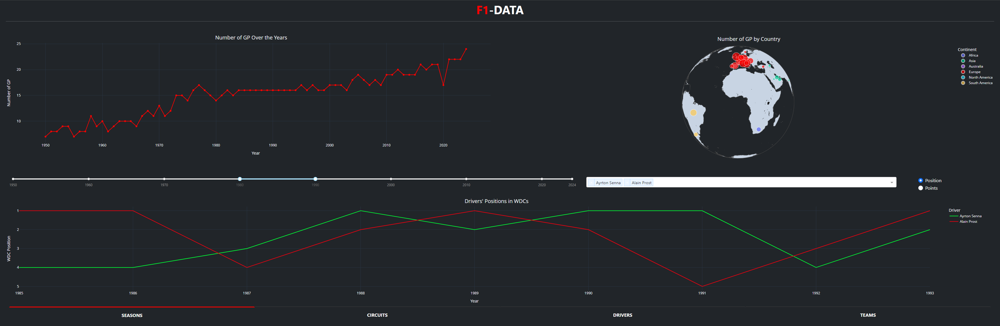
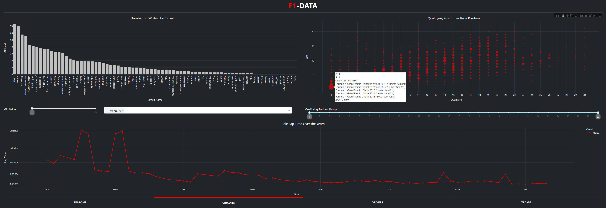
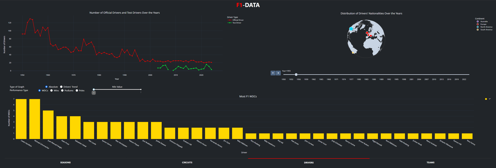
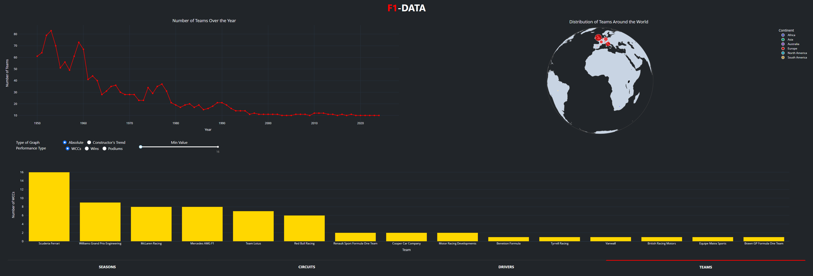

# F1-DATA
<hr>
Dashboard to Analyze data about Formula 1.
For a proper presentation we suggest to view [F1 DATA](./F1-ARD.pdf)

<hr>

### How
Python
<hr>

### USAGE
- ```pip install pandas plotly dash dash_bootstrap_components```
- ```git clone https://github.com/f1saw/f1-data.git```
- ```cd f1-data```
- ```python dashboard.py```
- Go to ```http://127.0.0.1:8050/```

<hr>

### DATASET
[f1db](https://github.com/f1db/f1db)

<hr>

#### SEASONS


#### CIRCUITS


#### DRIVERS


#### TEAMS
